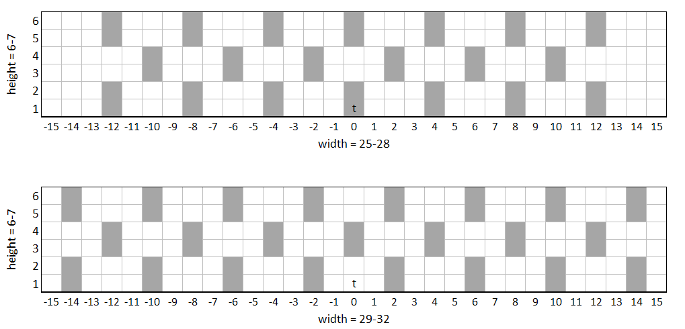
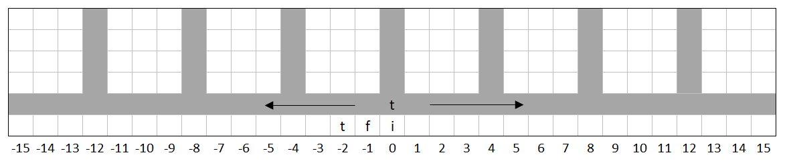

## getGithub
Downloads programs from this repository onto a turtle. The name of the program can be a command line argument:

`getGithub strip`

downloads the _strip_ program.

When two command line arguments are given, the first one represents the name of the branch in this repository:

`getGithub test strip`

downloads the _strip_ program from the _test_ branch.

With

`wget https://raw.githubusercontent.com/Erlkoenigs/computercraft/master/getGithub.lua getGithub.lua`

this script can be loaded onto the turtle initially.

## strip
Creates parallel 1x2 tunnels (or "strips"). On it's way back down each strip it will scan for and mine ore veins.
If, at any point, the turtles inventory is full, it will return to an item chest, dump its contents and will resume mining where it left off. It needs fuel in slot 1 and torches in slot 2.

Variable parameters:
* width
* height and
* depth

..of the mining area.

This image show two examples of the strip layout created by the turtle (t) as viewed from behind. The upper layout is created when the input width ranges from 25 to 28 with an input height of 5 to 6. The lower layout is created with an input width ranging from 29 to 32 and an input height of 5 to 6. The spacing between strips is 3. The input width will be reduced until width + 3 is a multitude of 4. The turtle will then go a maximum of (width - 1) / 2 steps to either side of its starting position and will dig as many strips as can fit into that length.

Once one row of strips is finished, the turtle will go up two blocks and start another row, but shift the position of strips so that the strips of the new row are diagonal to the strips of the first row and will do the same on the following rows. The turtle will fit as many rows of strips into the input height as possible.

The depth parameter determines the length of the strips. 

Parameters can be input via command line arguments:

`strip 190 20 80`

sets the width to 190, height to 20 and depth to 80.

This image shows the setup and the area of operations of the turtle (t):
* chest to dump items into (i) behind the starting position
* chest with fuel (f) to the left of the item chest
* chest with torches (t) to the left of the fuel chest

The turtle will try to fill the fuel and troch slots (1 and 2) to 64 items every time it returns to dump its inventory into the item chest.
If there's not enough fuel or torches in the chests, it will wait until there is.

The entrance of a finished strip can be marked by a torch. The turtle will do the same and skip, but still count, marked strips.

The turtle will place torches every 12 blocks. This can be changed by modifying the _torchDistance_ variable.

To make sure that the turtle won't escape into nowhere due to an undiscovered bug, it doesn't dig when it shouldn't need to. Because of this it is possible that the turtle gets stuck when lava and water create cobblestone in the turtles path.

The turtle can move outside of the specified area when following an ore vein. You might want to define the mining area a little smaller than the chunk loaded area.

Lava and water wash away or destroy torches. That way finished strips can't be marked and the turtle will work them again if it comes across them after a restart. The [lavaTunnel](https://github.com/Erlkoenigs/computercraft/blob/master/README.md#lavatunnel) program can help get rid of the lava.

Before it starts, the turtle will ask for a discord webhook url. If supplied, it can send messages about events to a discord channel. These events are: program start, program end, item chest full, fuel or torch chest empty, blocked path (with relative coordinates from starting position).

## quarry
Mimics a buildcraft quarry with a variable radius und depth.

The starting position is the middle of the area it will mine.

The center block is excluded from the radius, the diameter is 2*r+1: _r = 2_ will mine a 5x5 area.

Can be used to level an area to a certain depth.

Needs fuel in the first slot. Will try to dump items into a chest positioned directly above the starting position and will try to pull fuel from the same chest. For this the fuel has to be in the first slots of the chest.

## lavaTunnel
This program will create a 1x2 tunnel of variable length by placing a dummy material above, below and to the sides of it. This can be used to clear a path of a lava flow.

Usage:
* fuel in the first slot
* dummy material in the second slot

The turtle will come back 4 blocks towards the starting position after it is finished.

## bridge
Builds a simple bridge underneath it with a width of one block. 

The length is variable and can be input through command line arguments.

The turtle will not return after it is finished. 

If it is out of material, it will wait until it isn't.

Usage:
* fuel in first slot
* bridge material in second slot
